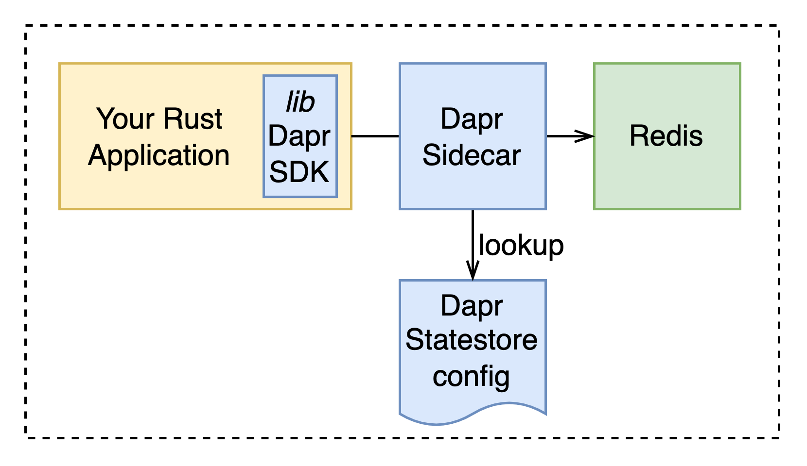

# Using the Dapr Rust SDK

This lab is build to illustrate how the Dapr Rust SDK can be used. In this application we increment a number in the connected Redis Dapr statestore. The diagram below shows the system setup.

**How complete the lab**:
1. Start Dapr locally: `dapr init`
2. Run the application: `dapr run --app-id dapr-rust-sdk --app-port 8081 --dapr-http-port 3500 -- cargo run`
3. Navigate to your browser or use the terminal to hit the endpoint a couple of times to test the application: `curl 127.0.0.1:8081`

Done!

<!-- version with wasmedge
`dapr run --app-id page-counter --dapr-http-port 3500 --log-level debug -- wasmedge --dir .:. --reactor --rustls_plugin ./WasmEdge/plugins/wasmedge_rustls/target/release/libwasmedge_rustls.so dapr-sdk-wasmedge/target/wasm32-wasi/debug/dapr-sdk-wasmedge.wasm`
-->