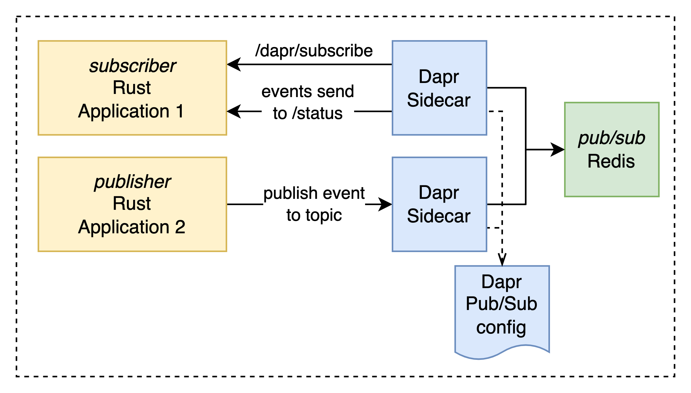

# Dapr Pub Sub

In this lab we will explore the use of the publish and subscribe Dapr component. The diagram below illustrates the architecture of the lab.

 **How complete the lab**:
 1. Start Dapr using `dapr init` this will create the Dapr pub/sub component. 
 2. Start the subscriber `dapr run --app-id dapr-pubsub-subscriber --app-port=8081 -- cargo run --manifest-path ./dapr-pubsub-subscriber/Cargo.toml`
 3. Start the publisher `dapr run --app-id dapr-pubsub-publisher -- cargo run --manifest-path ./dapr-pubsub-publisher/Cargo.toml`
 4. Observe the logs of both applications. You should see every three seconds a message with a timestamp and some meta information. 

Done!
