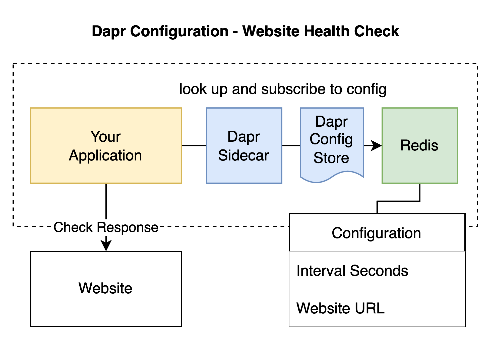

# LAB 6.2 Subscribing to Configuration Changes in Dapr

This lab illustrates the use of Dapr's configuration store. It features a Rust application which first collects configuration information and then establishes a subscription to update the collected configuration whenever changes are made.

The configuration specifies a website and an interval. The application checks based on the website and the interval the health (response) of the website. The diagram below illustrates the system we developed in this lab.

All applications that are used throughout the entire course are listed under [Installs](https://github.com/lftraining/LFD233-code/?tab=readme-ov-file#installs).

**How to start the lab**:
1. Start Redis locally: `docker run --name my-redis -p 6379:6379 -d redis:6`
2. Upload two configuration key value pairs into the redis database using the `set_config.sh` script. Example: `./set_config.sh http://google.com 10`. The script uses the [redis-cli](https://redis.io/docs/connect/cli/) which you may need to install first. The CLI is part of the redis-server package. Alternatively you can set the key value pairs `website_url` and `interval_seconds` manually.
3. Start dapr: `dapr init --slim`
4. Run the Dapr app with components: `dapr run --app-id website-health-check --resources-path ./components --app-port 8080  --dapr-http-port 3500 -- cargo run --manifest-path website-health-check/Cargo.toml`

