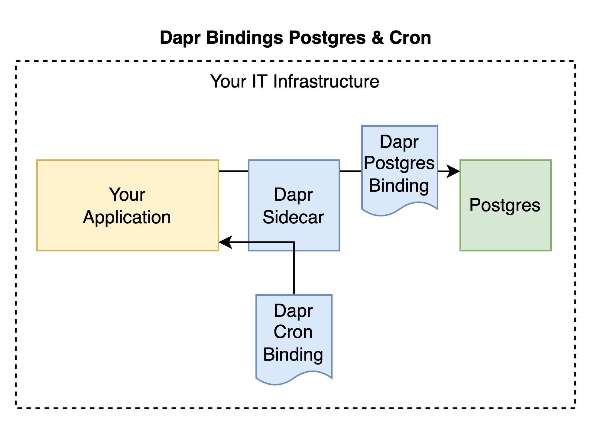

# SQL Timer Code

This lab shows the use of Dapr bindings. The diagram below illustrates the system that we build in this lab.

All applications that are used throughout the entire course are listed under [Installs](https://github.com/lftraining/LFD233-code/?tab=readme-ov-file#installs).

**How to complete the lab**:
1. Start Dapr: `dapr init --slim`
2. Build the custom postgres container: `docker build -f Containerfile -t postgres-custom .`
3. Start the Postgres database using docker: `docker run --name postgres-db -d -p 5432:5432 postgres-custom`
4. compile the Rust Application: `cargo build --manifest-path ./sql-timer-bindings/Cargo.toml --target wasm32-wasi`
5. Run the Dapr application using wasmedge and connect the bindings to it: `dapr run --app-id sql-timer-bindings --resources-path ./bindings --app-port 8080 --dapr-http-port 3500 --log-level debug  -- wasmedge ./sql-timer-bindings/target/wasm32-wasi/debug/sql-timer-bindings.wasm`

Stop the Dapr application after a couple of cron binding calls. The counter should have been incremented as printed in the console. Optionally, to check it use the `psql` client to connect to the database and look up the value. 

1. Look up the postgres table manually: `psql -h localhost -U postgres -d postgres`
2. enter the password `mypass`
3. Query the counter table: `SELECT counter FROM counter_table;`
