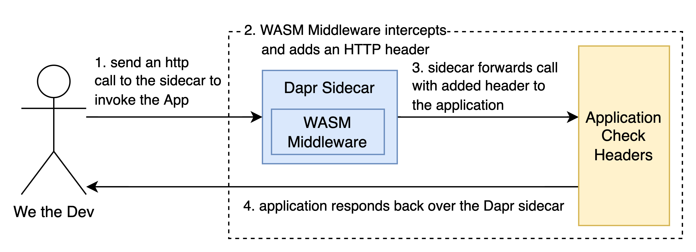

# Wasm middleware

This lab illustrates the use of the Dapr WASM middleware. The `custom-middleware` application is compiled to WASM format and registered as middleware in Dapr. The application updates a header. The application `http-header-check` receives incoming HTTP requests and checks if headers are set. If headers are missing a `StatusCode::BAD_REQUEST` gets returned.

All applications that are used throughout the entire course are listed under [Installs](https://github.com/lftraining/LFD233-code/?tab=readme-ov-file#installs).

**How to complete this lab**:
1. if not done before, run `rustup target add wasm32-wasi` to be able to compile to WASI format.
2. Compile the `custom-go-middleware` application: 
   1. Navigate to the folder with `cd custom-go-middleware`
   2. Run `tinygo build -o main.wasm -scheduler=none --no-debug -target=wasi main.go`
   3. Navigate to the parent folder with `cd ..`
3. Compile the `http-header-check` application: `cargo build --target wasm32-wasi --manifest-path http-header-check/Cargo.toml`
4. Run the appplication and register the middleware: `dapr run --app-id blankapp --dapr-http-port 3000 --app-port 8080 --resources-path ./components --config ./components/dapr-middleware-pipeline.yaml -- wasmedge http-header-check/target/wasm32-wasi/debug/http-header-check.wasm`
5. Call `http://localhost:3000/v1.0/invoke/blankapp/method/check-header` and check if the header was set
6. Call `http://localhost:8080/check-header` and check that the header was not set since the middleware route and therefore didn't fire
