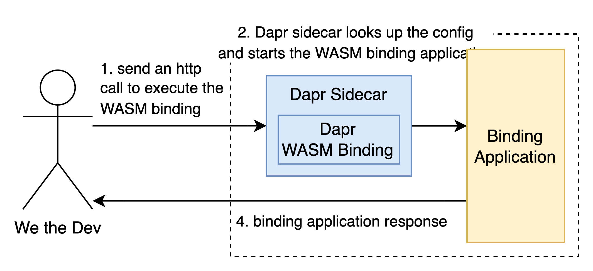

# Wasm output binding

This lab illustrates how WASM can be used to serve as an output binding in Dapr. In this lab, we need a simple `"Hello World!"` Rust application which we will register as a binding. Whenever the binding gets executed, the application will print `"Hello World!"` or, in our case, `"Hello binding!"`.

**How to complete this lab**:
1. Build the `dapr-wasm-binding` application
   1. `cd dapr-wasm-binding`
   2. `cargo build --target wasm32-wasi --release`
   3. `cd ..`
2. Start Dapr using `dapr init`
3. Start a dapr sidecar and register the binding and `dapr run --app-id wasm --dapr-http-port 3000 --resources-path components`
4. Execute the binding `curl -X POST http://localhost:3000/v1.0/bindings/wasm -d'{"operation": "execute"}'`
   1. Expected output: `Hello, binding!`
